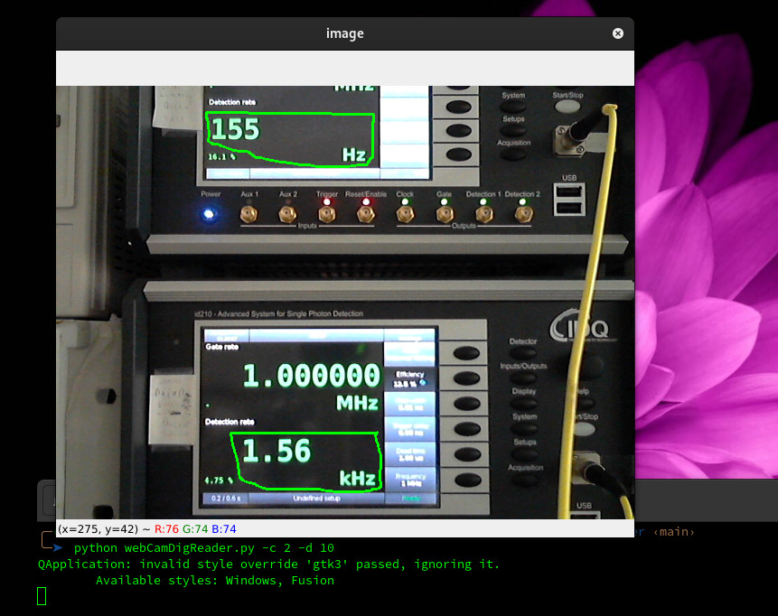

# webCamDigReader
Captures a frame from two regions of the screen and saves the recognized digits in a CSV file.

## Installation

```sh
python -m venv .env
source .env/bin/activate
pip install -r requirements.txt

python webCamDigReader.py -h


usage: webCamDigReader.py [-h] [-r REGIONS] [-g GAMMA] [-c CAMERA] [-d DELAY] [-f FILE] [-o OUT] [-debug]

WebCamDigReader captures and recognizes 
numerical data from designated screen regions, 
and subsequently saves the results in a CSV file. 
You can define these regions, as well as various 
other parameters, to customize your experience.

On the window selection screen, 
you can use the following commands:

- 'r': Reset all drawn regions
- 's': Save your defined regions
- 'q': Quit the application

options:
  -h, --help            show this help message and exit
  -r REGIONS, --regions REGIONS
                        Specify the number of regions to select. Defaults to 1.
  -g GAMMA, --gamma GAMMA
                        Adjust the gamma of the image for better brightness. Defaults to 1
  -c CAMERA, --camera CAMERA
                        Select the camera source. Defaults to 0.
  -d DELAY, --delay DELAY
                        Set the delay between frames in seconds. Defaults to 10.
  -f FILE, --file FILE  Provide the JSON file with coordinates. Defaults to "rectangles_coordinates.json"
  -o OUT, --out OUT     Specify the output file for the CSV data. Defaults to "data_captured.csv".
  -debug, --debug       Enable debug mode. If set, intermediate images will be saved during preprocessing.

```


